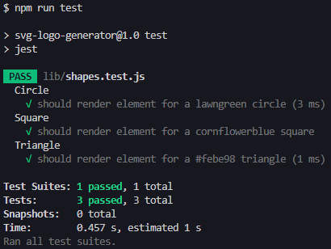

# SVG Logo Generator

## Table of Contents
- [Description](#description)
- [Features](#features)
- [Installation](#installation)
- [Demo](#demo)
- [Screenshots](#screenshots)
- [Tests](#tests)
- [Credits](#credits)
- [License](#license)

## Description

This application allows you to generate a logo and save it as a [SVG](https://www.w3.org/Graphics/SVG/) file.

 You will be prompted to answer questions to generate the logo such as text, text color, shape, and shape color. Once all questions are answered, the SVG logo will be saved in the **logo.svg** file. 
 
 To start the app, please reference the [Installation](#installation) instructions below.

## Features

* [Node.js](https://nodejs.org/en) to execute JavaScript in CLI or *outside* of web browser.
* [Built-in file system module](https://nodejs.org/api/fs.html) to write **logo.svg** file.
* [Inquirer v8.2.4](https://www.npmjs.com/package/inquirer) for interactive user input. In this app, two types of input are used: input and list, and two optional functions were implemented to manipulate and validate input: filter and validate.
* [Jest v29.7.0](https://jestjs.io/docs/getting-started) for testing Circle, Square, and Triangle classes in **lib/shapes.js**.
* [Scalable Vector Graphics (SVG)](https://www.w3.org/Graphics/SVG/) to create a custom SVG logo.

## Installation

1. Download [Node.js](https://nodejs.org/en).
2. Download repo files by [cloning the repo](https://docs.github.com/en/repositories/creating-and-managing-repositories/cloning-a-repository#cloning-a-repository) or [downloading the ZIP folder](https://github.com/apri1mayrain/svg-logo-generator/archive/refs/heads/main.zip). If downloading ZIP folder, please be sure to extract the folder.
3. Open your preferred command line interface.
3. Navigate to the file directory containing the repo.
4. Install the Inquirer and Jest NPM with command: `npm install`
5. Start the app to generate your logo.svg file with command: `node index.js`

## Demo

Click photo below to view demo video:

## Screenshots

Terminal results:

Invalid answers for text and color:

triangle.svg file content:

Generated SVG examples:

## Tests

Run tests for Circle, Square, and Triangle classes with command: `npm run test`

Tests are stored in **lib/shapes.test.js**.

Terminal after running passing tests:

Terminal after running a failed Circle class test:

## Credits

* Reference for 140 HTML color names: [https://htmlcolorcodes.com/color-names/](https://htmlcolorcodes.com/color-names/)

* Researched Stack Overflow forums and other coding resources.

## License

MIT License - Copyright © 2024 apri1mayrain

[(Go back to top)](#svg-logo-generator)